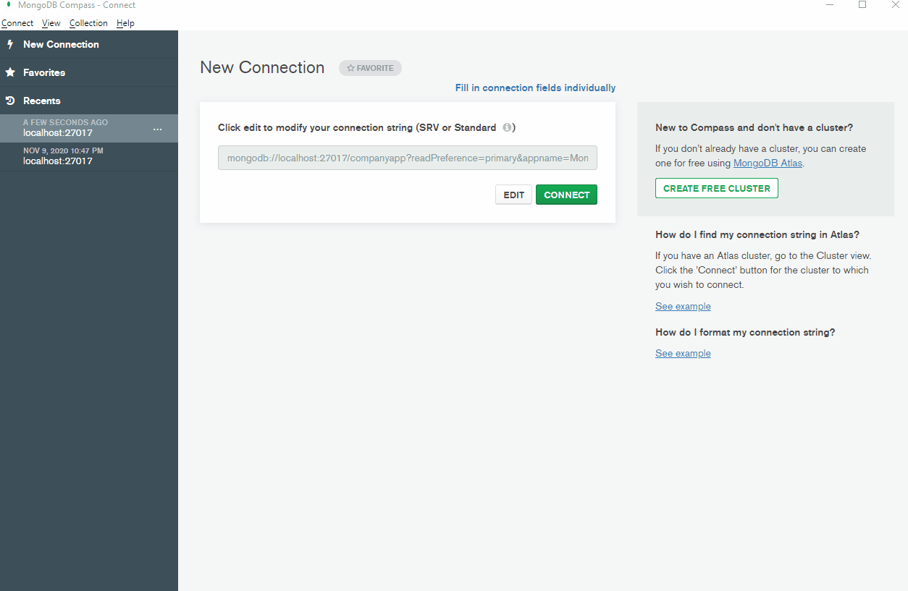
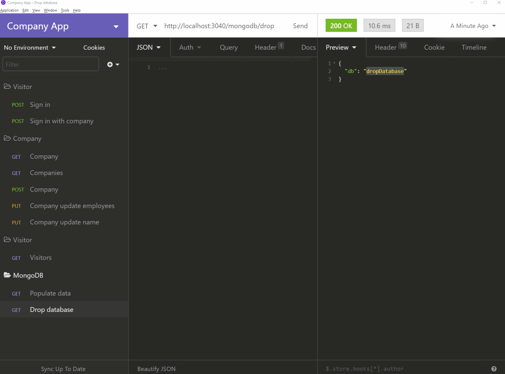

# Simple company visitor app (Server)

## What you neeed before you start the NodeJS server

#### MongoDB

FOR MAC:

> brew install mongodb

FOR Windows:

> Download here: https://www.mongodb.com/try/download/community

### NOTICE

MongoDb version in start-mongo-windows script may very from each installation.
Do verify the version number during installtion: C:/Program Files/MongoDb/Server/4.4

```
"scripts": {
    ...
    "start-mongo-windows": "md mongo-db & \"C:/Program Files/MongoDb/Server/4.4/bin/mongod.exe\" --dbpath mongo-db"
    ...
  },
```

## How to start server:

### Install NodeJS dependencies

_For Mac_

> npm install

> npm run start-mongo-mac

_For Windows_

> npm install

> npm run start-mongo-windows

Info doc here for MongoDB with local npm script: https://www.jokecamp.com/blog/running-local-mongodb-with-npm-scripts/

_Start NodeJS server_

> npm start

### Tip: Connect MongoDB to see visual data in MongoDB Compass

_Connections string_

> mongodb://localhost:27017/companyapp

_URL_
https://www.mongodb.com/products/compass



### API Docs

_Insomnia_

You can import the API in Insomnia, see exported file in api-docs.


